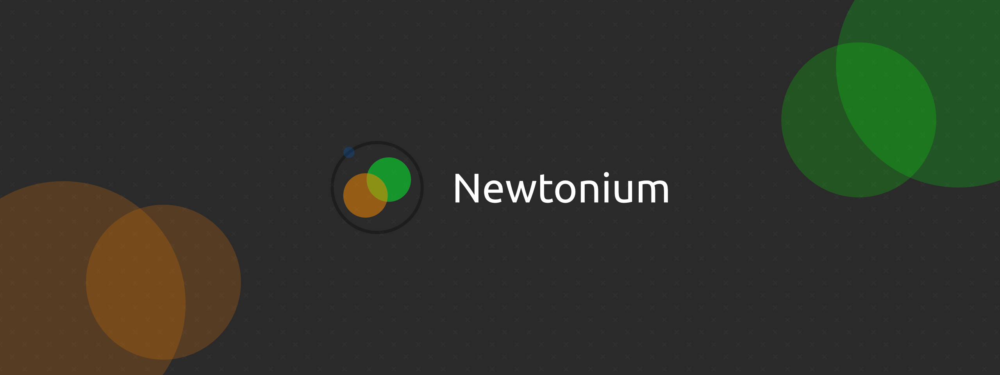

# Newtonium

> [!IMPORTANT]
> This project is in a very early development stage. Everything can change and nothing is guaranteed to work.

TypeScript and Rust based framework for building desktop applications using TypeScript and React. Newtonium is built on Webkit, Rust and Bun (with React using Next.JS), so it should be faster and lighter than Electron.

## Before you start
Note, that newtonium currently only supports development and building for Linux. Windows and MacOS support is planned.

You will also need to get the following dependencies:
- bun
- npm
- libwebkit2gtk-4.1-dev (`apt install libwebkit2gtk-4.1-dev`)
- libgtk-3-dev (`apt install libgtk-3-dev`)

## Getting started
To get started with Newtonium, you first need to install our main library, which includes the CLI.

```bash
npm install -g newtonium
```

This will take a while, because it needs to download the binaries, but you can add `--foreground-scripts` flag to track the progress.

### Creating a new project
To create a new project, you can use the following command:

```bash
newtonium init my-app
```

This will create a folder with the new project, install all dependencies and setup everything needed.

### Running the project

You can run the development server using the following command (start in the project folder):

```bash
bun run start
```

## Building the project
You can build the project using the following command:

```bash
newtonium build
```

This will create a file called dist.AppImage, which you can run and distribute.

## Project structure
There are two main folders in the project:
- `src` - Contains the source code of the project - your functions for interactions with hardware, window management and so on.
- `src/view` - Contains the source code of the UI - Next.JS project (only static exports are supported, you can use IPC for interacting with hardware)

MORE INFO ON GITHUB: [MartinGamesCZ/Newtonium](https://github.com/MartinGamesCZ/Newtonium)

## Roadmap
- [x] Working prototype
- [x] Custom webkit embedding
- [ ] Windows support
- [ ] MacOS support
- [ ] Mobile (android) support
- [x] Custom IPC
- [ ] Internal client library
- [ ] Support for building background services

## Let me know
If you featured Newtonium in your project, please let me know, I would love to see it.

If you have featured Newtonium in some article, or video, please let me know, I would love to see it.

## Contact me
You can find my contact information on my [GitHub profile](https://github.com/MartinGamesCZ).

## Authors
- [Martin Petr](https://github.com/MartinGamesCZ)

## Support me
If you want to support me, you can give this project a star on GitHub. You can also donate me (if you want to, please contact me).
